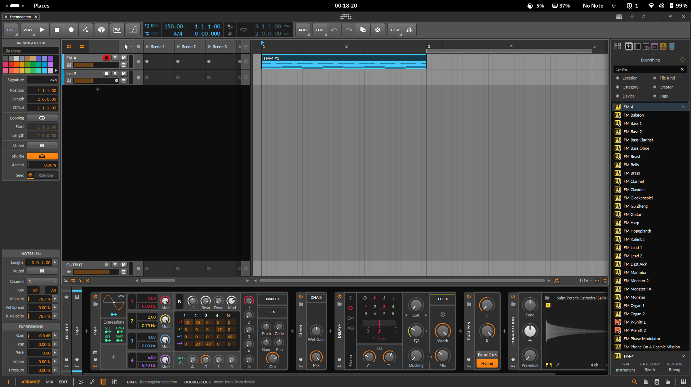
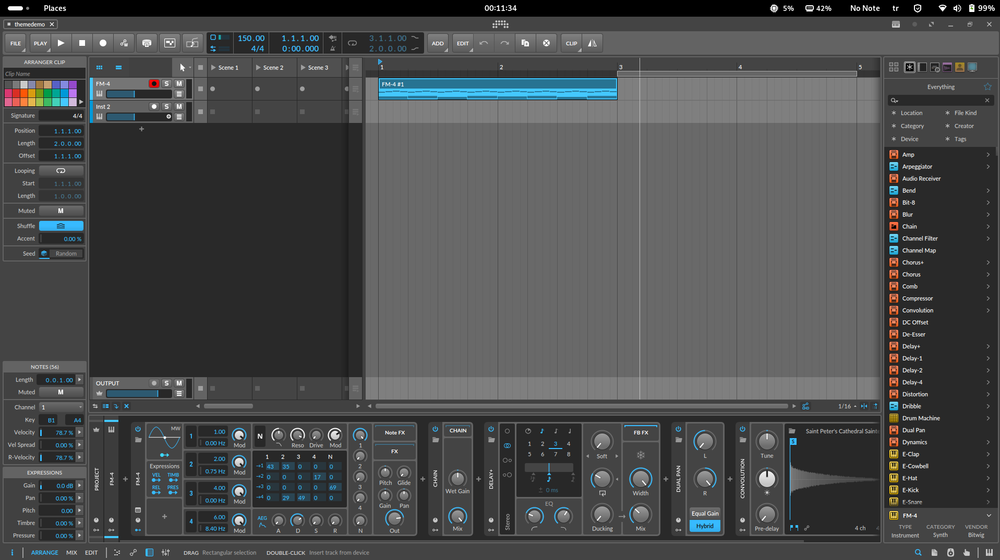
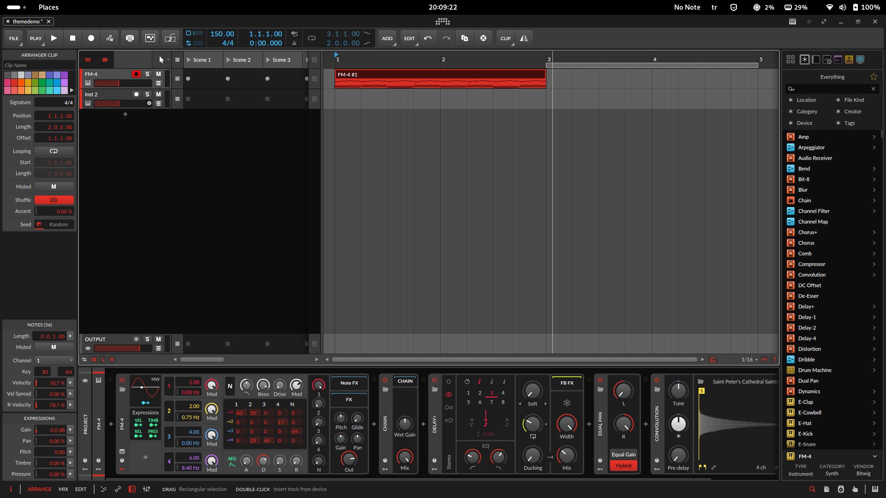
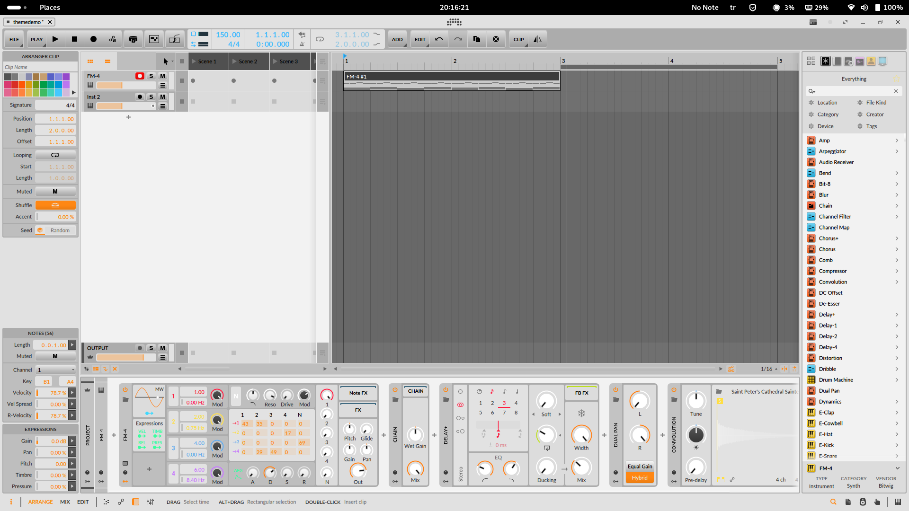

# Bitwig Studio Theme Editor

A theme editor for Bitwig Studio, written in java. Bitwig meets themes, finally!

It should work with any version in theory, but it has not been tested extensively yet.

> Please back up your **bitwig.jar** file before running the app, just in case.

## Download

[](https://github.com/Berikai/bitwig-theme-editor/releases/latest)

Head to the [Releases page](https://github.com/Berikai/bitwig-theme-editor/releases) to download the latest version.

## Usage

You can run the app directly without parameters to use it with a simple UI.


Alternatively, you can run:
```bash
java -jar bitwig-theme-editor.jar <bitwig-jar-path> [command] <theme-path>
```

**Available commands**:

- export: Exports the current theme to the specified file path (overwrites existing file). 
- apply: Applies the theme by modifying the bitwig.jar file based on the specified theme file.

**Example usage**:
```bash
java -jar bitwig-theme-editor.jar /opt/bitwig-studio/bin/bitwig.jar export current-bitwig-theme.yaml
# or
java -jar bitwig-theme-editor.jar /opt/bitwig-studio/bin/bitwig.jar apply current-bitwig-theme.json
```

### Brief Explanation

First, run the app using the `export` command to create theme file based on your **bitwig.jar** file. This file will be in JSON or YAML format depending on your choice. Then, edit the color values in the theme file to your liking. After that, run the app with the `update` command. 

Voilà! You have themed your Bitwig!

> Note: Using RGBA values instead of RGB values is not supported, as it may cause glitches in the Bitwig UI. However, you can use RGBA values where RGBA values are already in use.

## Development

This project is built using the following tools.

- IntelliJ IDEA Community Edition
- Java 17 JDK

Open the project with a Java IDE of your choice; IntelliJ IDEA is recommended. You can build the project with the `jar` task via Gradle.

## Contribution

Pull requests are welcome!

## Example Themes

Example themes can be found in [Themes](themes) folder

#### Bitwig Default



#### Medium Blue



#### Dark Red



#### Ultra Light



## License

This project is licensed under the MIT License - see the [LICENSE](LICENSE) file for details.

